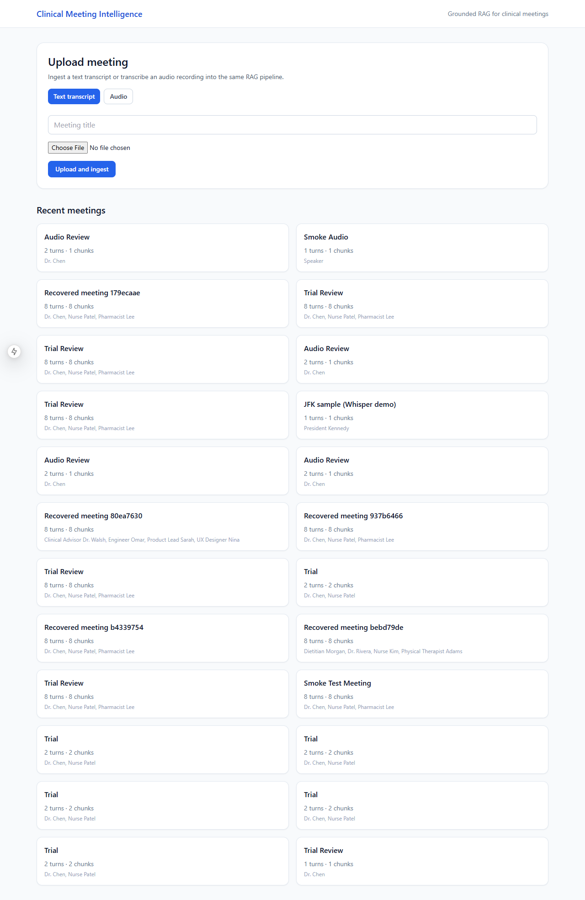
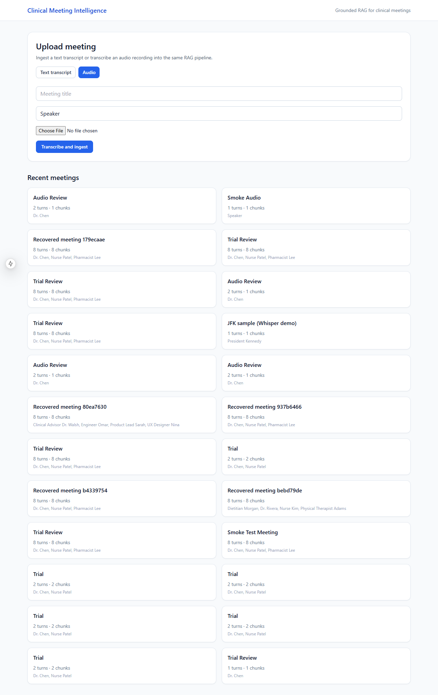
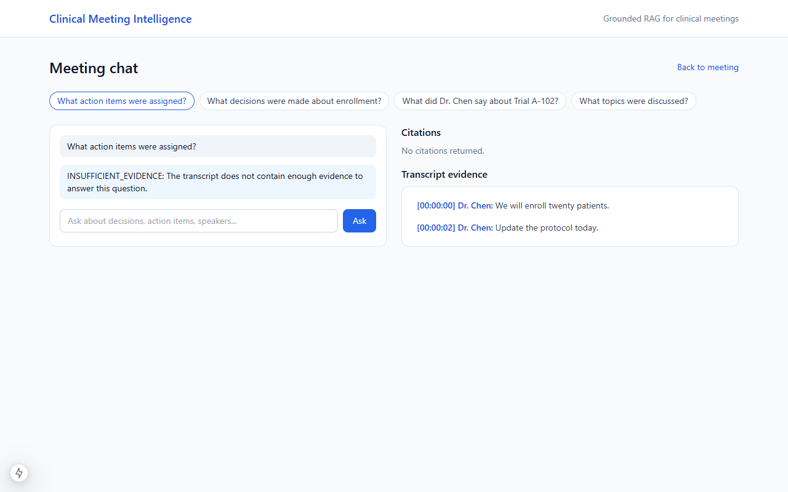
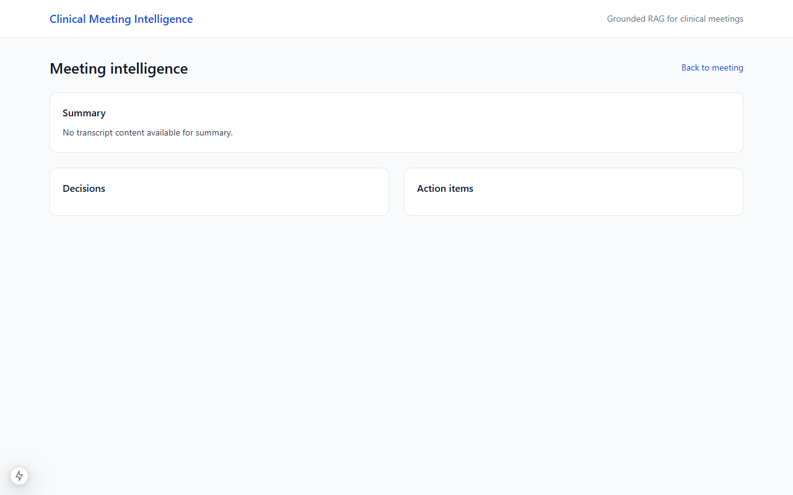
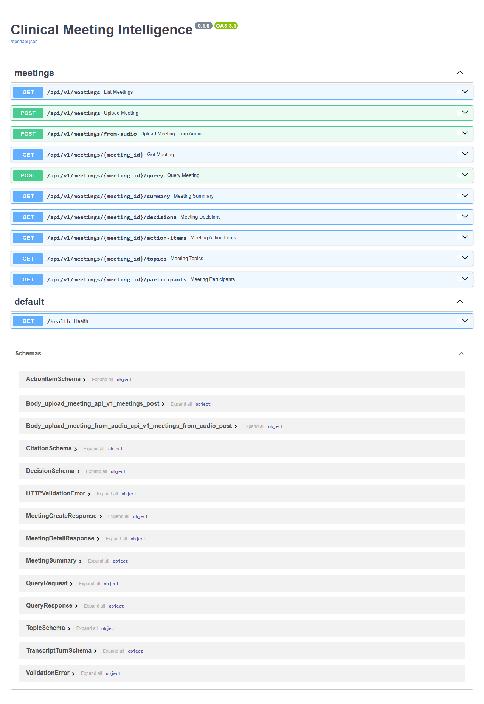
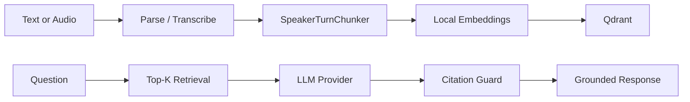

# Meeting Intelligence RAG

A self-learning full-stack project for **clinical-style meeting intelligence**: ingest transcripts (text or audio), index them with speaker-aware chunking, and ask grounded questions with citations. Includes meeting summaries, decisions, action items, and optional local voice transcription.

Built to explore RAG architecture, provider-agnostic LLM design, and practical guardrails — not tied to any employer or assignment.

## What it does

- Upload **`.txt` transcripts** (`[HH:MM:SS] Speaker: text`) or **audio** (`.wav`, `.mp3`, `.m4a`, `.webm`, `.ogg`)
- **Speaker-aware chunking** — keeps attribution for “What did Dr. Chen decide?” style queries
- **Grounded Q&A** with speaker/timestamp citations and refusal when evidence is missing
- **Meeting intelligence** — summary (LLM), decisions/action items/topics (heuristics + RAG)
- **Provider-agnostic LLM** — swap Ollama, OpenAI, or Anthropic via one env var

## Quick start

### Prerequisites

| Tool | Version | Purpose |
|------|---------|---------|
| Python | 3.12+ | Backend API |
| Node.js | 22+ | Frontend |
| Docker | any recent | Qdrant vector DB |
| Ollama | optional | Local LLM (default) |

### 1. One-time setup (Windows)

```powershell
git clone https://github.com/Mohamed-Ibrahim-124/meeting-intelligence-rag.git
cd meeting-intelligence-rag
.\scripts\setup.ps1
```

This creates `.env`, installs dependencies, starts Qdrant, and optionally pulls `llama3.1:8b` via Ollama.

### 2. Start the app

**Option A — local dev (recommended for learning)**

```powershell
.\scripts\start-local.ps1
```

**Option B — Docker Compose (all services)**

```powershell
cp .env.example .env   # if not done yet
docker compose up --build
```

### 3. Load sample data

```powershell
python scripts/seed_samples.py
```

### 4. Open the UI

| Service | URL |
|---------|-----|
| Frontend | http://localhost:3000 |
| API | http://localhost:8000 |
| API docs | http://localhost:8000/docs |

Try uploading `samples/audio/jfk.wav` on the **Audio** tab to test transcription.

### 5. Verify & capture screenshots

```powershell
python scripts/smoke_test.py
python scripts/capture_screenshots.py
```

See [`docs/SCREENSHOTS.md`](docs/SCREENSHOTS.md) for UI captures.

---

## Screenshots

| | |
|---|---|
|  |  |
|  |  |
|  |  |

---

## Models & providers

The stack is **provider-agnostic** where it matters: business logic talks to ports/adapters, not vendor SDKs directly. You configure models via `.env` — no code changes.

### LLM (question answering & summaries)

Set `LLM_PROVIDER` to one of:

| Provider | `LLM_PROVIDER` | Config | API key? | Default model |
|----------|----------------|--------|----------|---------------|
| **Ollama** (local) | `ollama` | `OLLAMA_BASE_URL`, `OLLAMA_MODEL` | No | `llama3.1:8b` |
| **OpenAI** | `openai` | `OPENAI_API_KEY`, `OPENAI_MODEL` | Yes | `gpt-4o-mini` |
| **Anthropic** | `anthropic` | `ANTHROPIC_API_KEY`, `ANTHROPIC_MODEL` | Yes | `claude-3-5-haiku-20241022` |

Any model supported by the provider’s API works — just change the model env var.

**Example — use OpenAI instead of Ollama:**

```env
LLM_PROVIDER=openai
OPENAI_API_KEY=sk-...
OPENAI_MODEL=gpt-4o-mini
```

### Embeddings (retrieval)

| Component | Runtime | Config | Notes |
|-----------|---------|--------|-------|
| **sentence-transformers** | Local (Hugging Face) | `EMBEDDING_MODEL` | Default: `BAAI/bge-small-en-v1.5` (~130 MB, auto-downloads on first start) |

Other Hugging Face embedding models work if you change `EMBEDDING_MODEL`.

### Speech-to-text (audio upload)

| Component | Runtime | Config | Notes |
|-----------|---------|--------|-------|
| **faster-whisper** | Local (Hugging Face) | `WHISPER_MODEL_SIZE`, `WHISPER_DEVICE`, `WHISPER_COMPUTE_TYPE` | Default: `small` (~500 MB, downloads on first audio upload) |

Sizes: `tiny`, `base`, `small`, `medium`, `large-v3`, `large-v3-turbo`

| Profile | Settings |
|---------|----------|
| Laptop / CPU | `WHISPER_MODEL_SIZE=tiny`, `WHISPER_DEVICE=cpu`, `WHISPER_COMPUTE_TYPE=int8` |
| GPU | `WHISPER_MODEL_SIZE=large-v3-turbo`, `WHISPER_DEVICE=cuda`, `WHISPER_COMPUTE_TYPE=float16` |

No speaker diarization yet — all segments use `TRANSCRIPT_DEFAULT_SPEAKER` (overridable per upload).

### Vector database

| Component | Runtime | Config |
|-----------|---------|--------|
| **Qdrant** | Docker | `QDRANT_URL`, `QDRANT_COLLECTION` |

---

## Environment variables

Copy `.env.example` → `.env`. Key groups:

```env
# Embeddings (Hugging Face, local)
EMBEDDING_MODEL=BAAI/bge-small-en-v1.5

# Vector store
QDRANT_URL=http://localhost:6333

# LLM — pick one provider
LLM_PROVIDER=ollama          # ollama | openai | anthropic
OLLAMA_MODEL=llama3.1:8b
OPENAI_API_KEY=
OPENAI_MODEL=gpt-4o-mini
ANTHROPIC_API_KEY=
ANTHROPIC_MODEL=claude-3-5-haiku-20241022

# RAG
RETRIEVAL_TOP_K=5
MAX_CONTEXT_TOKENS=3000

# Audio transcription (local Whisper)
WHISPER_MODEL_SIZE=small
WHISPER_DEVICE=auto
WHISPER_COMPUTE_TYPE=default
TRANSCRIPT_DEFAULT_SPEAKER=Speaker
```

See [`.env.example`](.env.example) for the full list with comments.

### Model downloads & SSL (Windows)

Models pull from Hugging Face on first use. If you see SSL errors:

```powershell
$env:SSL_CERT_FILE = python -c "import certifi; print(certifi.where())"
$env:REQUESTS_CA_BUNDLE = $env:SSL_CERT_FILE
```

`setup.ps1` and `start-local.ps1` set this automatically.

---

## Architecture



| Layer | Path | Role |
|-------|------|------|
| Domain | `backend/src/clinical_meeting/domain/` | Dataclasses |
| Services | `.../services/` | Ingestion, retrieval, answer, intelligence |
| Ports | `.../ports/` | `EmbeddingProvider`, `VectorStore`, `LLMProvider`, `TranscriptionProvider` |
| Adapters | `.../adapters/` | Qdrant, sentence-transformers, Ollama/OpenAI/Anthropic, faster-whisper |
| API | `.../api/` | FastAPI routes |
| UI | `frontend/src/` | Next.js 15 + Tailwind |

---

## Design notes

### Why meeting intelligence?

Generic doc Q&A loses **who said what**. Speaker-turn chunking + citation metadata makes queries like “What did the PI decide about enrollment?” actually work.

### Chunking

- Merge short same-speaker turns (< ~50 tokens)
- Split long turns at sentence boundaries (~400 token max)
- Preserve speaker, timestamps, turn indices

### Retrieval

1. Query normalization
2. Optional speaker filter
3. Vector top-k from Qdrant
4. Numbered evidence blocks for the LLM
5. Post-generation citation check

### Embedding choice

Benchmarked on `eval/golden_qa.json`:

| Model | Recall@5 | Latency |
|-------|----------|---------|
| **BAAI/bge-small-en-v1.5** | **0.867** | 18 ms |
| all-MiniLM-L6-v2 | 0.800 | 11 ms |

Re-run: `python eval/benchmark_embeddings.py`

### Guardrails

- Answer only from retrieved context; explicit refusal when insufficient
- Upload size/type validation
- No arbitrary code execution

---

## Development

```powershell
# Backend tests
cd backend
pip install -e ".[dev]"
pytest

# Lint / typecheck
ruff check src tests
mypy src

# Frontend
cd frontend
npm install
npm run dev
```

CI runs ruff, mypy, pytest (~80%+ coverage), and bandit on push.

---

## Samples

| Path | Description |
|------|-------------|
| `samples/transcripts/*.txt` | Synthetic clinical meeting transcripts |
| `samples/audio/jfk.wav` | Public Whisper test clip (~11s speech) |
| `eval/golden_qa.json` | 15 evaluation questions |

---

## Not built (yet)

- Live mic / WebRTC streaming
- Speaker diarization (WhisperX / pyannote)
- Auth / multi-tenancy
- Hybrid BM25 + reranking
- Async transcription workers

---

## Production ideas

| Component | Options |
|-----------|---------|
| Frontend | CloudFront, Vercel, Static Web Apps |
| API | ECS, Container Apps, Fly.io |
| Vectors | Qdrant Cloud, pgvector |
| LLM | Bedrock, Azure OpenAI, or self-hosted GPU |
| Transcription | GPU worker queue + larger Whisper models |

---

## License

Personal learning project. Sample transcripts are synthetic; audio sample sourced from the [OpenAI Whisper test suite](https://github.com/openai/whisper).
